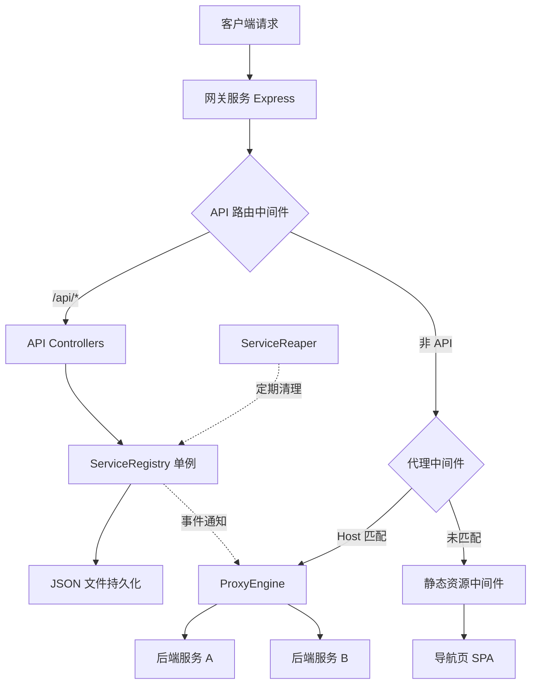
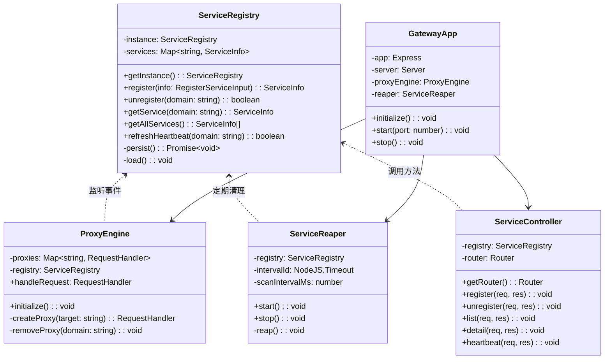

## 产品概述

一个运行在 Docker 中的轻量级域名网关系统（hellocola-gateway），核心能力是根据 HTTP 请求的 Host 头将流量动态转发到不同的本地服务。各服务启动时通过 RESTful API 主动向网关注册自身的域名与地址映射，并通过心跳机制保持存活状态。当访问的域名未匹配任何已注册服务时，展示一个蓝白主基调的个人主页导航页，已注册的服务以卡片形式呈现在页面中。

## 核心功能

1. **动态反向代理**：根据 HTTP 请求的 Host 头匹配已注册域名，将请求转发至对应的后端服务地址，支持 HTTP 和 WebSocket 代理
2. **服务动态注册 API**：提供 RESTful 接口，支持幂等注册（同一域名重复注册时更新信息）、主动注销、查询服务列表和单个服务详情
3. **心跳保活机制**：各子服务定期向网关发送心跳请求续约，网关刷新该服务的存活时间；超时未收到心跳的服务自动注销清理
4. **服务注册表持久化**：内存存储 + JSON 文件持久化，网关重启后可恢复已注册服务；恢复后的服务标记为"待心跳确认"状态，超时未确认则清理
5. **导航页（个人主页）**：蓝白主基调，参考 Vercel/Linear 等主流产品主页设计风格，包含 Hero 区域、已注册服务卡片展示区、页脚等模块；通过 API 动态获取服务列表并以卡片形式展示
6. **静态资源托管**：前端构建产物由服务端托管，未匹配域名时默认返回导航页
7. **Docker 部署**：多阶段构建 Dockerfile + docker-compose 编排，一键启动

## 技术栈

### 服务端

- **运行时**: Node.js 20 LTS
- **语言**: TypeScript 5.x
- **HTTP 框架**: Express.js
- **反向代理**: http-proxy-middleware（基于 http-proxy，支持 HTTP/WebSocket 代理）
- **构建**: tsc 编译
- **日志**: 自研 Logger 工具类（基于 console，带级别和时间戳）

### 前端

- **框架**: React 18 + TypeScript
- **构建工具**: Vite 5
- **样式**: Tailwind CSS 3
- **HTTP 客户端**: fetch API

### 部署

- **容器化**: Docker 多阶段构建
- **编排**: docker-compose

### 包管理

- 根目录 monorepo 结构，使用 npm workspaces 管理 server 和 web 两个子包

## 实现方案

### 整体策略

网关服务作为单一 Node.js 进程运行，内部通过中间件链实现请求处理流程：`请求日志 -> CORS -> API 路由 -> 反向代理 -> 静态资源兜底`。核心采用面向对象设计：

- **单例模式**：ServiceRegistry 全局唯一注册表实例
- **观察者模式**：ServiceRegistry 继承 EventEmitter，注册/注销时广播事件，ProxyEngine 监听事件动态更新路由
- **策略模式**：ProxyEngine 根据 Host 头匹配不同的代理策略进行转发

### 关键技术决策

1. **反向代理实现**：使用 `http-proxy-middleware` 而非手写 proxy。该库是 Express 生态中最成熟的代理方案，支持 WebSocket 升级、路径重写、错误处理。代理实例在服务注册/注销时动态创建和销毁，按域名缓存在 Map 中复用。

2. **服务注册表设计**：采用 `ServiceRegistry` 单例类，内部维护 `Map<string, ServiceInfo>` 数据结构。提供幂等的 `register` 方法（upsert 语义），变更时通过 EventEmitter 广播事件。同时异步 debounce 写入 JSON 文件持久化，重启时加载恢复。

3. **心跳与超时清理**：

- ServiceInfo 增加 `lastHeartbeat`（最后心跳时间戳）和 `ttl`（存活超时秒数，默认 30s）字段
- 新增 `ServiceReaper` 类，使用 `setInterval` 定期扫描注册表（默认 10s），清理超过 ttl 未收到心跳的服务
- 网关重启后加载持久化服务时，标记为"待心跳确认"，60s 内未收到心跳则清理

4. **请求匹配流程**：提取 Host 头（去掉端口号）-> 注册表 Map O(1) 查找 -> 匹配成功转发 -> 匹配失败 fallback 到静态资源

5. **前端静态托管**：Vite 构建产物输出到 `web/dist`，服务端通过 `express.static` 托管，所有未匹配 GET 请求返回 `index.html`（SPA 模式）

### API 设计

| 方法 | 路径 | 说明 |
| --- | --- | --- |
| POST | /api/services | 注册服务（幂等，重复注册更新信息） |
| DELETE | /api/services/:domain | 主动注销服务 |
| GET | /api/services | 查询所有已注册服务列表 |
| GET | /api/services/:domain | 查询单个服务详情 |
| PUT | /api/services/:domain/heartbeat | 心跳续约 |
| GET | /api/health | 网关健康检查 |


### 注册请求体

```
{
  "domain": "app.example.com",
  "target": "http://localhost:8080",
  "name": "My App",
  "description": "My awesome app",
  "icon": "https://example.com/icon.png",
  "ttl": 30
}
```

## 实现注意事项

1. **Host 头解析**：需处理带端口号的情况（如 `example.com:3000`），统一取 hostname 部分进行匹配
2. **CORS 处理**：API 路由需配置 CORS，允许导航页前端跨域调用（开发环境 Vite devServer 和生产环境同源均需考虑）
3. **JSON 持久化性能**：采用 debounce（300ms）异步写入，避免频繁 IO；Docker 环境下使用 volume 挂载 `/app/data` 确保数据持久化
4. **代理错误处理**：proxy 出错时返回 502 Bad Gateway，记录错误日志但不影响其他请求
5. **优雅关闭**：监听 SIGTERM/SIGINT 信号，停止 ServiceReaper 定时器，关闭 HTTP Server
6. **前端开发代理**：Vite 配置 devServer proxy 到后端 `/api`，方便前后端分离开发

## 架构设计

### 系统架构



### 核心类设计



## 目录结构

整个项目采用 monorepo 结构，server 和 web 作为两个独立子包，通过 npm workspaces 管理。服务端采用分层架构（core/api/middleware/utils），前端采用标准 React 组件化项目结构。

```
hellocola-gateway/
├── package.json                    # [NEW] 根 monorepo 配置，定义 workspaces: ["server", "web"]，配置统一的 dev/build/start 脚本
├── tsconfig.base.json              # [NEW] 共享 TypeScript 基础配置，strict 模式、ES2022 target、ESM 模块
├── Dockerfile                      # [NEW] 多阶段构建：Stage 1 安装依赖，Stage 2 构建前端，Stage 3 构建服务端，Stage 4 精简运行镜像仅含产物和生产依赖
├── docker-compose.yml              # [NEW] 编排配置，映射端口 80:3000，挂载 data volume 持久化 /app/data
├── .dockerignore                   # [NEW] 排除 node_modules、.git、dist 等
├── server/                         # 服务端子包
│   ├── package.json                # [NEW] 服务端依赖：express、http-proxy-middleware、cors；devDep：typescript、@types/*
│   ├── tsconfig.json               # [NEW] 继承根 tsconfig.base.json，outDir=dist，rootDir=src
│   └── src/
│       ├── index.ts                # [NEW] 入口。创建 GatewayApp 实例调用 initialize/start，监听 SIGTERM/SIGINT 优雅关闭
│       ├── app.ts                  # [NEW] GatewayApp 类。组装 Express 应用，按顺序挂载中间件链，管理 ProxyEngine、ServiceReaper 生命周期，提供 start/stop
│       ├── core/
│       │   ├── index.ts            # [NEW] 核心模块统一导出
│       │   ├── ServiceRegistry.ts  # [NEW] 服务注册表单例类。继承 EventEmitter，Map 存储，幂等 register（upsert），心跳 refreshHeartbeat 刷新 lastHeartbeat，debounce 异步 JSON 持久化，启动加载恢复并标记待确认
│       │   ├── ProxyEngine.ts      # [NEW] 代理引擎类。监听 Registry 事件动态管理 http-proxy-middleware 实例缓存，handleRequest 提取 Host O(1) 匹配转发，代理错误返回 502
│       │   └── ServiceReaper.ts    # [NEW] 超时清理器类。setInterval 定期扫描（默认 10s），清理超过 ttl 未心跳的服务，恢复后 60s 未确认的服务也清理。提供 start/stop 控制定时器
│       ├── api/
│       │   ├── index.ts            # [NEW] API 路由统一导出，创建 /api 前缀 Router 挂载 ServiceController 和 HealthController
│       │   ├── ServiceController.ts # [NEW] 服务管理控制器。POST 注册（含 ttl 字段）、DELETE 注销、GET 列表/详情、PUT 心跳续约，参数校验和统一响应格式
│       │   └── HealthController.ts # [NEW] 健康检查控制器。GET /api/health 返回网关状态、已注册服务数、运行时长
│       ├── middleware/
│       │   ├── index.ts            # [NEW] 中间件统一导出
│       │   ├── requestLogger.ts    # [NEW] 请求日志中间件。记录方法、URL、Host、状态码和耗时
│       │   ├── errorHandler.ts     # [NEW] 全局错误处理中间件。捕获异常返回统一 JSON 错误格式
│       │   └── staticServe.ts      # [NEW] 静态资源服务中间件。express.static 托管 web/dist，GET fallback 到 index.html
│       ├── types/
│       │   └── index.ts            # [NEW] 类型定义。ServiceInfo（含 lastHeartbeat/ttl/status）、RegisterServiceInput、ApiResponse、ServiceStatus 枚举
│       └── utils/
│           ├── index.ts            # [NEW] 工具统一导出
│           ├── logger.ts           # [NEW] Logger 类。带级别（debug/info/warn/error）、时间戳、模块名前缀，LOG_LEVEL 环境变量控制
│           └── config.ts           # [NEW] 配置管理类。从环境变量读取 PORT/DATA_DIR/LOG_LEVEL/REAPER_INTERVAL/DEFAULT_TTL，类型安全默认值
├── web/                            # 前端子包
│   ├── package.json                # [NEW] 前端依赖：react、react-dom；devDep：vite、typescript、tailwindcss、postcss、autoprefixer、@types/*
│   ├── tsconfig.json               # [NEW] 前端 TS 配置，继承根配置，jsx: react-jsx
│   ├── tsconfig.app.json           # [NEW] 应用级 TS 配置，include src 目录
│   ├── vite.config.ts              # [NEW] Vite 配置。build 输出 dist，devServer proxy /api 到 http://localhost:3000
│   ├── tailwind.config.js          # [NEW] Tailwind 配置。蓝白主题色（primary: blue-600 系列），扩展 fontFamily 使用 Poppins
│   ├── postcss.config.js           # [NEW] PostCSS 配置，tailwindcss + autoprefixer
│   ├── index.html                  # [NEW] HTML 入口，引入 Google Fonts Poppins，viewport meta
│   └── src/
│       ├── main.tsx                # [NEW] React 入口，createRoot 渲染 App
│       ├── App.tsx                 # [NEW] 根组件，组装 Header -> HeroSection -> ServiceGrid -> Footer
│       ├── index.css               # [NEW] 全局样式，@tailwind 指令，CSS 动画 keyframes，全局变量
│       ├── components/
│       │   ├── Header.tsx          # [NEW] 顶部导航栏。固定顶部 64px，毛玻璃背景（backdrop-blur），Logo + GitHub 链接，滚动加阴影
│       │   ├── HeroSection.tsx     # [NEW] Hero 区域。60-70vh，渐变文字大标题 + 副标题，深蓝渐变背景 + CSS 几何光晕装饰，入场淡入上移动画
│       │   ├── ServiceGrid.tsx     # [NEW] 服务卡片网格容器。调用 useServices Hook，管理加载/空/错误状态，响应式网格（3/2/1列）
│       │   ├── ServiceCard.tsx     # [NEW] 服务卡片。图标（无图标显示首字母）+ 名称 + 域名 + 描述（两行截断），hover 上浮 + 蓝色边框，点击新标签页跳转
│       │   ├── Footer.tsx          # [NEW] 页脚。浅灰背景，「Powered by HelloCola Gateway」+ 版权年份
│       │   └── LoadingSpinner.tsx  # [NEW] 加载动画组件。蓝色旋转 spinner
│       ├── hooks/
│       │   └── useServices.ts      # [NEW] 自定义 Hook。fetch /api/services，管理 loading/error/data，支持定时轮询刷新
│       ├── services/
│       │   └── api.ts              # [NEW] API 调用封装。fetchServices、fetchServiceByDomain，统一错误处理
│       └── types/
│           └── index.ts            # [NEW] 前端类型定义。ServiceInfo 接口（与后端对齐）、ApiResponse 类型
```

## 关键代码结构

### ServiceInfo 类型定义（含心跳字段）

```typescript
// server/src/types/index.ts
export enum ServiceStatus {
  ACTIVE = 'active',
  PENDING = 'pending',  // 重启恢复后待心跳确认
}

export interface ServiceInfo {
  domain: string;
  target: string;
  name: string;
  description?: string;
  icon?: string;
  ttl: number;              // 存活超时秒数，默认 30
  lastHeartbeat: number;    // 最后心跳时间戳 (Date.now())
  status: ServiceStatus;
  registeredAt: string;
}

export interface RegisterServiceInput {
  domain: string;
  target: string;
  name: string;
  description?: string;
  icon?: string;
  ttl?: number;
}

export interface ApiResponse<T = unknown> {
  success: boolean;
  data?: T;
  error?: string;
  message?: string;
}
```

### ServiceRegistry 核心签名（含心跳方法）

```typescript
// server/src/core/ServiceRegistry.ts
export class ServiceRegistry extends EventEmitter {
  private static instance: ServiceRegistry;
  private services: Map<string, ServiceInfo>;

  static getInstance(dataDir?: string): ServiceRegistry;

  register(input: RegisterServiceInput): ServiceInfo;       // 幂等 upsert，emit 'service:registered'
  unregister(domain: string): boolean;                      // emit 'service:unregistered'
  refreshHeartbeat(domain: string): boolean;                // 刷新 lastHeartbeat，PENDING -> ACTIVE
  getService(domain: string): ServiceInfo | undefined;
  getAllServices(): ServiceInfo[];
  getActiveServices(): ServiceInfo[];                       // 仅返回 ACTIVE 状态服务

  private persist(): Promise<void>;                         // debounce 300ms 异步写 JSON
  private load(): void;                                     // 同步加载，标记为 PENDING
}
```

### ServiceReaper 核心签名

```typescript
// server/src/core/ServiceReaper.ts
export class ServiceReaper {
  private registry: ServiceRegistry;
  private intervalId: NodeJS.Timeout | null;
  private scanIntervalMs: number;

  constructor(registry: ServiceRegistry, scanIntervalMs?: number);

  start(): void;     // 启动定时扫描
  stop(): void;      // 停止定时器
  private reap(): void;  // 扫描并清理超时服务
}
```

## 设计风格

采用现代科技感设计风格，以蓝白为主基调，融合毛玻璃效果（Glassmorphism）和精致微动画，打造一个高端、专业的个人主页/网关导航页。整体视觉参考 Vercel、Linear 等知名产品主页的设计语言，强调留白、层次和动感。使用 Tailwind CSS 实现全部样式，不引入第三方组件库，确保轻量和高度定制。

## 页面设计（单页应用）

### Block 1 - 顶部导航栏（Header）

固定在页面顶部，高度 64px。左侧展示 Logo 文字「HelloCola Gateway」采用蓝色渐变，右侧放置 GitHub 图标链接。背景采用毛玻璃效果（backdrop-blur-lg），初始完全透明，页面滚动超过 50px 后显示白色半透明背景（bg-white/80）并添加底部细线阴影，transition 平滑过渡。z-index 置顶。

### Block 2 - Hero 区域（HeroSection）

占据首屏视口 65vh 高度，作为视觉焦点。居中展示大标题「HelloCola Gateway」使用 bg-clip-text 渐变色文字（从 blue-500 到 indigo-600），字号 4xl-6xl 响应式。下方副标题「A lightweight dynamic gateway for your services」浅灰色。背景使用从深蓝（slate-900）到白色的径向渐变，配合 CSS 实现的几何装饰元素：两个模糊渐变圆形光晕（蓝色和靛蓝色，opacity 低，absolute 定位），和一层淡淡的网格线纹理。底部有平滑的曲线 SVG 过渡到白色区域。入场时标题和副标题有淡入上移的 CSS animation（opacity 0->1, translateY 20px->0, duration 0.8s）。

### Block 3 - 服务卡片区域（ServiceGrid）

白色背景区域，上方标题「Registered Services」居中，带蓝色下划线装饰。下方为响应式网格布局（lg:grid-cols-3, md:grid-cols-2, grid-cols-1, gap-6）。每张 ServiceCard 卡片：白色背景圆角（rounded-xl）带浅灰边框（border-gray-100），内部左侧为服务图标区域（48x48 圆形，有图标时展示图标，无图标时展示域名首字母 + 蓝色渐变背景），右侧为文字区域（名称 font-semibold text-gray-900，域名 text-sm text-gray-400，描述 text-sm text-gray-600 line-clamp-2）。hover 时卡片 translateY(-4px) + shadow-lg + border-blue-200 过渡。点击整张卡片可跳转到对应域名。加载中显示 3 个骨架屏卡片（animate-pulse 灰色色块），无数据时展示空状态图示和「No services registered yet」提示。

### Block 4 - 页脚（Footer）

简约页脚，bg-gray-50 背景，上方细线分隔（border-t border-gray-200）。居中展示「Powered by HelloCola Gateway」文字（text-gray-400 text-sm）和动态版权年份。padding 上下 32px。

## 交互设计

- Hero 区域 CSS @keyframes fadeInUp 入场动画，staggered delay 标题先于副标题
- 服务卡片 hover: transition-all duration-300 ease-out 浮动效果
- 卡片点击 cursor-pointer，a 标签包裹，target="_blank" rel="noopener"
- 导航栏滚动变化 transition-all duration-300
- 光晕装饰元素使用 CSS animation 做缓慢浮动（translate 来回，duration 8-12s）

## 响应式设计

- 桌面端（>= 1024px）：max-w-6xl mx-auto，卡片 3 列，Hero 标题 text-6xl
- 平板端（>= 768px）：卡片 2 列，Hero 标题 text-4xl，padding 缩小
- 移动端（< 768px）：卡片 1 列，Hero 标题 text-3xl，导航栏 Logo 文字缩小